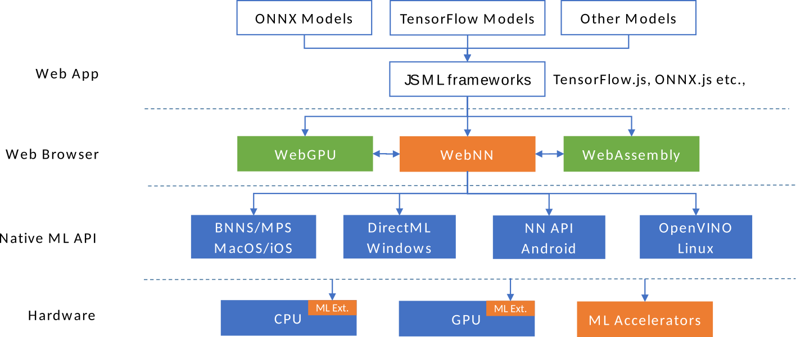

# Web Neural Network API Explained

## What’s all this then?

[Machine Learning](https://en.wikipedia.org/wiki/Machine_learning), and in particular its subfield [Deep Learning](https://en.wikipedia.org/wiki/Deep_learning) with its various neural network architectures, enable new compelling user experiences for web applications. Use cases range from intelligent video conferencing to privacy-enhancing and accessibility-improving features. Some common use cases that apply to a wide range of web applications include e.g.:

- Person detection
- Face detection
- Semantic segmentation
- Skeleton detection
- Style transfer
- Super resolution
- Image captioning
- Machine translation
- Noise suppression

These use cases and more are elaborated in the [use cases section of the API specification](https://webmachinelearning.github.io/webnn/#usecases).

While some of these use cases can be implemented in a constrained manner with existing Web APIs (e.g. WebGL graphics API, as demonstrated by the [WebNN API polyfill](https://github.com/webmachinelearning/webnn-polyfill) and the first-wave JS ML frameworks), no access to platform capabilities beneficial for ML such as dedicated ML hardware accelerators constraints the scope of experiences and leads to inefficient implementations on modern hardware. This disadvantages the web platform in comparison to native platforms.

The design process of the [Web Neural Network API](http://webmachinelearning.github.io/webnn/) (WebNN API) started by identifying the [key use cases](https://webmachinelearning.github.io/webnn/#usecases) working with the [diverse participants](https://www.w3.org/community/webmachinelearning/participants) including major browser vendors, key ML JS frameworks, interested hardware vendors, and web developers. After identification of the key use cases, the group worked down the levels of abstraction and [decomposed the key use cases into requirements](https://github.com/webmachinelearning/webnn/blob/master/op_compatibility/first_wave_models.md). The aim of this use case-driven design process was to put [user needs first](https://w3ctag.github.io/design-principles/#priority-of-constituencies).

With emerging AI innovations in both software and hardware ecosystem, one of the main challenges for the web is to bridge this software and hardware development and bring together a solution that scales across hardware platforms and works with any framework for web AI experiences. We propose the WebNN API as an abstraction for neural networks in the web browsers.



As illustrated in the architecture diagram of the figure above, web browsers may implement the WebNN API using native machine learning API available in the operating system. This architecture allows JavaScript frameworks to tap into cutting-edge machine learning innovations in the operating system and the hardware platform underneath it without being tied to platform-specific capabilities, bridging the gap between software and hardware through a hardware-agnostic abstraction layer. 

At the heart of neural networks is a computational graph of mathematical operations. These operations are the building blocks of modern AI and machine learning technologies in computer vision, natural language processing, and robotics. 

The WebNN API is a specification for constructing and executing computational graphs of neural networks. It provides web applications with the ability to create, compile, and run machine learning networks on the web browsers. The WebNN API may be implemented in web browsers using the available native operating system machine learning APIs for the best performance and reliability of results. The following code sample illustrates a simple usage of this API.

``` JavaScript
const operandType = {type: 'float32', dimensions: [2, 2]};
const context = navigator.ml.getNeuralNetworkContext();
const builder = context.createModelBuilder();
// 1. Create a model of the computational graph 'C = 0.2 * A + B'.
const constant = builder.constant(0.2);
const A = builder.input('A', operandType);
const B = builder.input('B', operandType);
const C = builder.add(builder.mul(A, constant), B);
const model = builder.createModel({'C': C});
// 2. Compile the model into executable.
const compilation = await model.compile();
// 3. Bind inputs to the model and execute for the result.
const bufferA = new Float32Array(4).fill(1.0);
const bufferB = new Float32Array(4).fill(0.8);
const inputs = {'A': {buffer: bufferA}, 'B': {buffer: bufferB}};
const outputs = await compilation.compute(inputs);
// The computed result of [[1, 1], [1, 1]] is in the buffer associated with
// the output operand.
console.log('Output shape: ' + outputs.C.dimensions);
console.log('Output value: ' + outputs.C.buffer);
```

Check it out in [WebNN Code Editor](https://webmachinelearning.github.io/webnn-samples/code/?example=mul_add.js).

### Goals

Web applications and frameworks can take advantage of the native operating system services for machine learning and the underlying hardware innovations available on the user's computers to implement consistent, efficient, and reliable AI experiences on the web platform.

### Non-goals

1. We do not define model serialization format. Formats are framework's choices, which may be vendor-specific. The role of the WebNN API is to facilitate solutions that work across the web regardless of the model format by leveraging the underlying support available in the target platform for reliable and efficient results.

2. We do not define the packaging and delivery mechanism of machine learning models, such as the choice of encryption and content protection.

3. The machine learning model's input may be of any media type, such as video streams, images, or audio signals. We do not define new media types but relying on the existing web standards for media types needed for respective scenarios.

### Target hardware

Web applications and frameworks can target typical computing devices on popular operating systems that people use in their daily lives. Initial prototypes demonstrate respectable performance on:

* Smartphones e.g. Google Pixel 3 or similar
* Laptops e.g. 13" MacBook Pro 2015 or similar

The WebNN API is not tied to specific platforms and is implementable by existing major platform APIs, such as:

* Android Neural Networks API
* Windows DirectML API
* macOS/iOS ML Compute API

Depending on the underlying hardware capabilities, these platform APIs may make use of CPU parallelism, general-purpose GPU, or dedicated hardware accelerators for machine learning. The WebNN API provides [performance adaptation](https://webmachinelearning.github.io/webnn/#usecase-perf-adapt) options but remains hardware agnostic.

## Getting started

A core abstraction behind popular neural networks is a computational graph, a directed graph with its nodes corresponding to operations (ops) and input variables. One node's output value is the input to another node. The WebNN API brings this abstraction to the web.

In the WebNN API, the [`Operand`](https://webmachinelearning.github.io/webnn/#operand) objects represent input, output, and constant multi-dimensional arrays known as [tensors](https://mathworld.wolfram.com/Tensor.html). The [`NeuralNetworkContext`](https://webmachinelearning.github.io/webnn/#api-neuralnetworkcontext) defines a set of operations that facilitate the construction and execution of this computational graph. Such operations may be accelerated with dedicated hardware such as the GPUs, CPUs with extensions for deep learning, or dedicated AI accelerators. These operations defined by the WebNN API are required by [models](https://github.com/webmachinelearning/webnn/blob/master/op_compatibility/first_wave_models.md) that address key application use cases. Additionally, the WebNN API provides affordances to builder a computational graph, compile the graph, execute the graph, and integrate the graph with other Web APIs that provide input data to the graph e.g. media APIs for image or video frames and sensor APIs for sensory data.

This [example](https://webmachinelearning.github.io/webnn/#examples) builds, compiles, and executes a graph comprised of three ops, takes four inputs and returns one output.

## Key scenarios

There are many important [application use cases](https://webmachinelearning.github.io/webnn/#usecases-application) for high-performance neural network inference. One such use case is deep-learning noise suppression (DNS) in web-based video conferencing. The following sample shows how the [NSNet2](https://github.com/microsoft/DNS-Challenge/tree/master/NSNet2-baseline) baseline implementation of deep learning-based noise suppression model may be implemented using the WebNN API.

```JavaScript
// Noise Suppression Net 2 (NSNet2) Baseline Model for Deep Noise Suppression Challenge (DNS) 2021.
export class NSNet2 {
  constructor() {
    this.model = null;
    this.compiledModel = null;
    this.frameSize = 161;
    this.hiddenSize = 400;
  }

  async load(baseUrl, batchSize, frames) {
    const nn = navigator.ml.getNeuralNetworkContext();
    const builder = nn.createModelBuilder();
    // Create constants by loading pre-trained data from .npy files.
    const weight172 = await buildConstantByNpy(builder, baseUrl + '172.npy');
    const biasFcIn0 = await buildConstantByNpy(builder, baseUrl + 'fc_in_0_bias.npy');
    const weight192 = await buildConstantByNpy(builder, baseUrl + '192.npy');
    const recurrentWeight193 = await buildConstantByNpy(builder, baseUrl + '193.npy');
    const bias194 = await buildConstantByNpy(builder, baseUrl + '194_0.npy');
    const recurrentBias194 = await buildConstantByNpy(builder, baseUrl + '194_1.npy');
    const weight212 = await buildConstantByNpy(builder, baseUrl + '212.npy');
    const recurrentWeight213 = await buildConstantByNpy(builder, baseUrl + '213.npy');
    const bias214 = await buildConstantByNpy(builder, baseUrl + '214_0.npy');
    const recurrentBias214 = await buildConstantByNpy(builder, baseUrl + '214_1.npy');
    const weight215 = await buildConstantByNpy(builder, baseUrl + '215.npy');
    const biasFcOut0 = await buildConstantByNpy(builder, baseUrl + 'fc_out_0_bias.npy');
    const weight216 = await buildConstantByNpy(builder, baseUrl + '216.npy');
    const biasFcOut2 = await buildConstantByNpy(builder, baseUrl + 'fc_out_2_bias.npy');
    const weight217 = await buildConstantByNpy(builder, baseUrl + '217.npy');
    const biasFcOut4 = await buildConstantByNpy(builder, baseUrl + 'fc_out_4_bias.npy');
    // Build up the network.
    const input = builder.input('input', {type: 'float32', dimensions: [batchSize, frames, this.frameSize]});
    const relu20 = builder.relu(builder.add(builder.matmul(input, weight172), biasFcIn0));
    const transpose31 = builder.transpose(relu20, {permutation: [1, 0, 2]});
    const initialState92 = builder.input('initialState92', {type: 'float32', dimensions: [1, batchSize, this.hiddenSize]});
    const [gru94, gru93] = builder.gru(transpose31, weight192, recurrentWeight193, frames, this.hiddenSize,
        {bias: bias194, recurrentBias: recurrentBias194, initialHiddenState: initialState92, returnSequence: true});
    const squeeze95 = builder.squeeze(gru93, {axes: [1]});
    const initialState155 = builder.input('initialState155', {type: 'float32', dimensions: [1, batchSize, this.hiddenSize]});
    const [gru157, gru156] = builder.gru(squeeze95, weight212, recurrentWeight213, frames, this.hiddenSize,
        {bias: bias214, recurrentBias: recurrentBias214, initialHiddenState: initialState155, returnSequence: true});
    const squeeze158 = builder.squeeze(gru156, {axes: [1]});
    const transpose159 = builder.transpose(squeeze158, {permutation: [1, 0, 2]});
    const relu163 = builder.relu(builder.add(builder.matmul(transpose159, weight215), biasFcOut0));
    const relu167 = builder.relu(builder.add(builder.matmul(relu163, weight216), biasFcOut2));
    const output = builder.sigmoid(builder.add(builder.matmul(relu167, weight217), biasFcOut4));
    this.model = builder.createModel({output, gru94, gru157});
  }

  async compile(options) {
    this.compiledModel = await this.model.compile(options);
  }

  async compute(inputBuffer, initialState92Buffer, initialState155Buffer) {
    const inputs = {
      input: {buffer: inputBuffer},
      initialState92: {buffer: initialState92Buffer},
      initialState155: {buffer: initialState155Buffer},
    };
    return await this.compiledModel.compute(inputs);
  }
}
```

Try the live version of the [WebNN NSNet2 example](https://webmachinelearning.github.io/webnn-samples/nsnet2/).  This live version builds upon [nsnet2.js](https://github.com/webmachinelearning/webnn-samples/blob/master/nsnet2/nsnet2.js) that implements the above code snippet as a JS module.

## Detailed design discussion

### Do we need a Web Neural Network API? Can we standardize on just a Model Loader API?

A [Model Loader API](https://github.com/webmachinelearning/model-loader/blob/master/explainer.md) loads a model from a specified URL and outputs a model object on which the caller can execute. It leaves all the responsibilities of loading and processing a neural network model to the web browsers and the underlying operating systems while offering the web developers a simple API surface, akin to an image loading API.

Although this design approach has a clear benefit in its simplicity, it faces a challenge in defining a standard model format that works across the various web browsers and operating systems on the user's devices. In shifting the focus of the design towards the model format, it creates an opportunity for more fragmentation in the way AI is consumed on the web and encourages silos of vendor-specific ecosystems around the particular model formats of choice. Much like in the early days of the image format wars, the web developers will likely have a more difficult time understanding which model formats would work on which combinations of the web browsers and operating systems that they're targeting.

By defining the WebNN API as a model format-agnostic set of neural network operations, we shift the focus of the design towards the abstraction between the web browsers and the underlying operating system services and let the web applications and JavaScript frameworks continue to focus on satisfying the needs of the web developers knowing that the neural networks they create will faithfully execute regardless of the browser's underlying platform. What we believe works in our favor is the significant overlap of neural network operations and algorithms across all popular frameworks today. Models available in one format are generally convertible to another with little loss.

A Model Loader API can also be built atop a Web Neural Network API without losing the appeal in its simplicity. Our view is that the two APIs are complementary and not mutually exclusive to each other; however we must start with the Web Neural Network API to ensure cross-platform interoperability, a cornerstone of the web platform.

An explainer for the Model Loader API can be found [here](https://github.com/webmachinelearning/model-loader/blob/master/explainer.md).

|                 | Web Neural Network API           | Model Loader API                         |
| ---             | ---                              | ----                                     |
| API style       | Graph builder (~low-level)       | Model loader (~high-level)               |
| Spec status     | Advancing to WG                  | Explainer                                |
| Impl experience | Chromium POC, webnn-native       | No                                       |
| Key customer    | JS ML frameworks                 | Web developers                           |
| Inference       | Yes                              | Yes                                      |
| Training        | No, but possible in future       | No                                       |
| Polyfill        | Yes                              | No, possible on top of WebNN API         |
| Interop         | Supported by major OS APIs       | No, due to lack of standard model format |

[1]: https://github.com/webmachinelearning/webnn-polyfill
[2]: https://github.com/webmachinelearning/webnn/blob/master/op_compatibility/first_wave_models.md

### What is the right level of abstraction for the neural network operations?

Neural network operations are mathematical functions. There are about a hundred standard functions universally supported in popular frameworks today e.g. convolution, matrix multiplication, various reductions, and normalizations. Additionally, some frameworks provide an even more extensive set of variants of these functions for ease of use. 

In designing the WebNN operations, a proposal to decompose high-level functions to the more rudimentary mathematical operations was considered, with the key benefit of having a reduced number of operations defined. However, such an approach would make the networks more verbose and harder to construct. It'll also risk losing the opportunity to leverage known optimizations for highly reusable functions in the operating systems and in the hardware platforms underneath it. For instance, most operating systems and modern hardware today support widely-used variants of convolutions and recurrent networks out of the box. By decomposing well-known functions into networks of rudimentary mathematical operations, their identities may be lost in the process with opportunities for significant performance gains left behind.

To balance the needs of providing for future extensibility while ensuring maximum reuse and performance optimization opportunity, we chose to include both the standard functions and all the smaller operations making up the functions in the spec. For each high-level function defined, we make sure that all of its decomposed operations are also defined. This way, a newly-conceived function may be represented as a network of our decomposed operations, while a standard function can also be fully supported by the underlying platforms. An elaborate example of this principle is in the way we define the specification of the [gruCell](https://webmachinelearning.github.io/webnn/#api-modelbuilder-grucell) operation as described in its notes.

## Considered alternatives

### Stay the course and build machine learning solutions on WebGL/WebGPU

WebGL and WebGPU are Web API abstraction to the underlying graphics API, which could be used to implement neural network operations that run on the GPU. Popular JavaScript machine learning frameworks such as TensorFlow.js already uses WebGL and are working on a WebGPU backend. An alternative to the WebNN proposal is to continue with this architecture and rely on JavaScript frameworks implemented with these graphics abstraction to address the current and future needs of AI scenarios on the web.

We believe this alternative is insufficient for two reasons. First, although graphics abstraction layers provide the flexibility of general programmability of the GPU graphics pipelines, they are unable to tap into hardware-specific optimizations and special instructions that are available to the operating system internals. The hardware ecosystem has been investing significantly in innovating in the AI space, and much of that is about improving the performance of intensive compute workloads in machine learning scenarios. Some key technologies that are important to model performance may not be uniformly accessible to applications through generic graphics pipeline states.

Secondly, the hardware diversity with numerous driver generations make conformance testing of neural network operations at the framework level more challenging. Conformance testing, compatibility, and quality assurance of hardware results have been the traditional areas of strength of the operating systems, something that should be leveraged by frameworks and applications alike. Since neural network models could be used in mission-critical scenarios such as in healthcare or industry processes, the trustworthiness of the results produced by the frameworks are of utmost importance to the users.

## References & acknowledgements

Thanks to all the [Machine Learning for the Web Community Group](https://www.w3.org/community/webmachinelearning/) and [W3C Workshop on Web and Machine Learning](https://www.w3.org/2020/06/machine-learning-workshop/) participants for their comments and feedbacks that have informed the design of this API.
