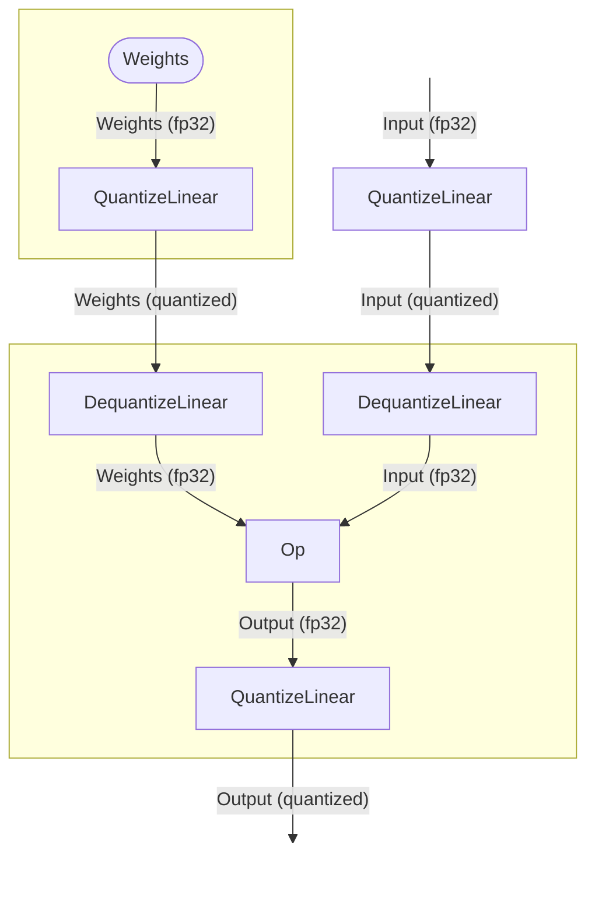
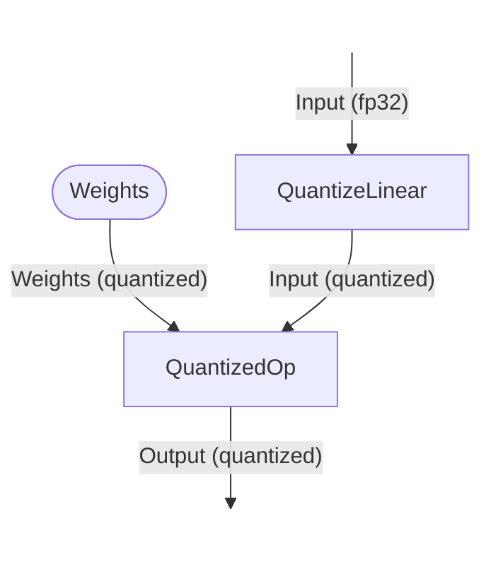

# Low Precision Data Types Explainer

## Introduction
This explainer summarizes the importance of low-precision floating point data types for web-based inference and proposes the expansion of MLOperandDataType to support emerging AI data type formats.                

- [Low Precision Data Types Explainer](#low-precision-data-types-explainer)
  - [Introduction](#introduction)
  - [Motivation](#motivation)
  - [Proposed data types overview and use cases](#proposed-data-types-overview-and-use-cases)
    - [1.	`bfloat16`](#1bfloat16)
    - [2.	`float8`](#2float8)
  - [Proposed changes](#proposed-changes)
    - [1.	Extend MLOperandDataType](#1extend-mloperanddatatype)
    - [2.	New scale descriptor for quantization](#2new-scale-descriptor-for-quantization)
    - [3.	Extend per-operator type tables](#3extend-per-operator-type-tables)
    - [4.	Extend buffer validation mechanism](#4extend-buffer-validation-mechanism)
  - [Data types and Q/DQ nodes handling](#data-types-and-qdq-nodes-handling)
  - [Accuracy implications](#accuracy-implications)
  - [Pros and cons](#pros-and-cons)
    - [Pros](#pros)
    - [Cons](#cons)
  - [Security and privacy considerations](#security-and-privacy-considerations)


## Motivation
The latest developments in both specialized hardware, as well as AI and large language models (LLMs) have radically shifted the bottlenecks of machine learning. Specifically in inference, such models are rarely compute-bound nowadays, they're limited by memory bandwidth and capacity. Loading and storing billions of parameters in 32-bit (`float8`) or even 16-bit (`float16`) floating-point formats results in a massive memory footprint and overwhelms the memory bandwidth, causing high latency and power consumption.

Hardware vendors in cooperation with software researchers proved, that in most cases model weights and activations can leverage lower-precision data types with negligible accuracy impact. This led to development of native silicon support in GPUs and NPUs for such data types, allowing to both save memory footprint by compressing the weights and activations, as well as increase the compute throughput.

Currently, WebNN supports `float32` and `float16`. To bring the desktop-class AI performance to the browser, WebNN must support the data types that modern hardware is designed to accelerate. This would enable developers to deploy massive models directly in the browser with native performance, dramatically reduced download times and accelerated inference speeds.

## Proposed data types overview and use cases
### 1.	`bfloat16`
Bfloat16 is a 16-bit floating-point format designed by Google Brain for training purposes. The main purpose of this format was to provide a full `float32` range at the expense of the precision. This was mainly used for the backpropagation passes of the training process to avoid an “exploding gradients” issue during the first several iterations. Combined with `float32` master weights this allowed to reduce the memory traffic and later leverage the hardware accelerated blocks with no influence on the quality of the trained model.

However, this format has been getting more traction lately in multiple application fields in inference as well, thanks to the high range of values. To name a few examples:
1.	StyleGAN-like models use modulated convolutions with renormalized weights at runtime. This weights normalization produces large intermediate values that can result in `float16` overflow, forcing the usage of higher-precision data types.
2.	In case of LLMs running with long contexts, KV-cache tensors and attention intermediates can span a wide dynamic range across layers and sequence length. `float16` range increases the risk of clipping and accumulated drift over long prefills and generation, degrading the output quality and causing inconsistencies.
3.	When using Mixture-of-Experts (MoE) models, different experts have sparse and uneven activation scales, sometimes varying by orders of magnitude. Extended range of `bfloat16` allows for more robust expert routing.

### 2.	`float8`
Float8 is a family of 8-bit floating point formats standardized under the OFP8 and Microscaling Formats (MX) Specification, extending the idea of using lower-precision data types and designed to roughly double the compute throughput relative to 16-bit floating point data types. Unlike 16-bit floating point data types, `float8` have a limited range and rely on scaling to stay numerically stable. Depending on the model, this scaling can be performed on a per-tensor, per-channel or per-block level.

OCP specification lists two main formats of `float8`, rearranging the bit allocation between the exponent and mantissa, named E5M2 (typical for gradients in training) and E4M3 (typical for weights and activations in inference), with one bit reserved for the sign. Those data types are primarily used in LLMs to speed up matrix multiplications and compress KV-cache but are also quite useful for diffusion and classical computer vision models, providing a hardware-friendly alternative to integer quantization, with competitive accuracy when properly scaled.

Despite easier upcast to `float16`, E5M2 subformat is primarily used in training and provides limited benefits for inference. In this explainer we'll focus on E4M3 format only.

## Proposed changes
We propose extending the MLOperandDataType enum and define, how these types interact with typed arrays, since JavaScript lacks native `bfloat16` and `float8` arrays.

### 1.	Extend MLOperandDataType
```javascript
enum MLOperandDataType {
  "float32",
  "float16",
  "int32",
  "uint32",
  "int64",
  "uint64",
  "int8",
  "uint8",
  // Proposed additions:
  "bfloat16",
  "float8"	// Synonymous to float8e4m3 in this scenario
};
```
To address the lack of those data types in JavaScript, developers will pass those weights as `Uint16Array` for `bfloat16`, and `Uint8Array` for `float8`.

### 2.	New scale descriptor for quantization
Current Q/DQ approach is designed with affine integer semantics in mind. The following changes extend it to address block-wise and microscaling formats.

```javascript
enum MLQuantizationScheme {
  "affine",           // scale * (x – zp) // existing
  "symmetric-float",  // x * scale, zp = 0
  "blockwise-float"  // per-block scaling tensor
};

dictionary MLQuantizationOptions : MLOperatorOptions {
  MLQuantizationScheme scheme = "affine";
  unsigned long blockSize;
};
```

### 3.	Extend per-operator type tables
Every operator specification provides a tensor limits table with allowed data types for different operands. With an introduction of additional low-precision floating-point data types those tables need to be reviewed and extended.

### 4.	Extend buffer validation mechanism
Currently, buffer validation is only done for strongly typed buffers. In case of low-precision floating-point data types, this check is significantly simplified and would always return True for `ArrayBufferView` due to usage of `Uint8Array`. The algorithm should consider that the low-precision data types are represented using non-native JavaScript data types, but the dimensions and the element count still needs to be validated.

## Data types and Q/DQ nodes handling
Due to a significant variety of hardware available to users, spanning across multiple generations, it is expected that some data types could be unsupported. WebNN delegates the graph execution to the underlying framework (like DirectML, CoreML, Windows ML).

If the data type is supported on the target hardware, the underlying inference framework will fuse the Q/DQ nodes into the operation, emitting a quantized operation. This is the best-case scenario with low memory footprint and good performance.

Figure 1 shows the explicit graph with Q/DQ nodes, that is obtained either by quantization-aware training (QAT) or by post-training quantization (PTQ) processes. The model quantization process treats those nodes as "fake" quantization, coarsening up the precision.


Figure 1. Subgraph with explicit Q/DQ nodes


There are two ways to execute such graph, depending on the hardware and software capabilities: native fused execution or emulation. In case the software stack supports fused execution, the graph in figure 1 would be transformed into the graph, depicted in figure 2.
 

Figure 2. Subgraph with fused Q/DQ nodes

It is important to mention, that the fused quantized operation doesn't necessarily mean optimized hardware support for the specific data type in matrix multiplication acceleration units. It can also represent the ability to provide an operation, that dequantizes the data on the registers without the need to submit a separate operation or kernel. The prime example of this is LLM inference with 4-bit weights and `float16` activations, where the weights are dequantized in the kernel prologue.

In case quantization fusion isn't supported for a specific operation-data type combination, the frameworks are expected to gracefully fall back to an explicit execution of quantize/dequantize operations. Those nodes can't be omitted for two reasons: quantization is a non-linear process, and there is a possibility, that during the QAT the weights were adjusted to meet the accuracy targets, which won't be reached without quantization.

The end goal is to execute the provided model when the hardware natively supports those data types and when it doesn't, a warning could be emitted to let the user know that this model is suboptimal on this machine due to a specific reason, to give the possibility of locating another model or requantizing it. WebNN backends can expose the list of supported data types as a first-line checks to provide a high-level feedback before passing the model for execution.

## Accuracy implications
It is evident, that reducing precision from 32-bit to 8-bit or even 4-bit introduces quantization noise. Thankfully, floating-point data types degrade a lot more gracefully than their integer counterparts (`int8` and `int4`).
1.	`bfloat16` — often near-lossless accuracy loss for most models, in most cases can be used as a stand-in replacement for `float16`.
2.	`float8` — in most cases requires a calibration dataset for post-training quantization. In most cases, outliers are handled better than in `int8` due to 4-bit exponent in E4M3 flavor.

## Pros and cons
### Pros
1.	Significant memory footprint and bandwidth savings compared to `float32`. Not all models are conformant in `float16`, currently forcing users to revert to `float32` instead of possible `bfloat16` variant.
2.	Unlocks the full hardware TOPS capabilities, which are often advertised in 8-bit or 4-bit data types.
3.	Low-precision floating point data types handle activation outliers better than a regular int8 symmetric quantization.
4.	Storing the weights in low-precision data types results in smaller model size, resulting in reducing the download time and memory footprint.

### Cons
1.	Introduces additional API complexity into `quantizeLinear` and `dequantizeLinear` ops to take block sizes and scales into account.
2.	Packing and unpacking low-precision floating point types using placeholder data storage containers like `Uint8Array` places an ergonomic burden on the web developer and reduces the amount of available type checks.
3.	Additional pressure is put on the WebNN backends to implement robust software fallbacks when hardware support is absent.

## Security and privacy considerations
The introduction of low-precision types doesn't introduce additional security threats beyond those already discussed in the main WebNN specification, like out-of-bounds memory access or timing attacks.

Different hardware architectures may leverage different data types for accumulation and implement different rounding approaches, because of that, model outputs may lack bit-wise determinism across devices. This fingerprinting vector is shared by all floating-point hardware acceleration units and should be mitigated by the same privacy mechanisms standard to WebNN.
